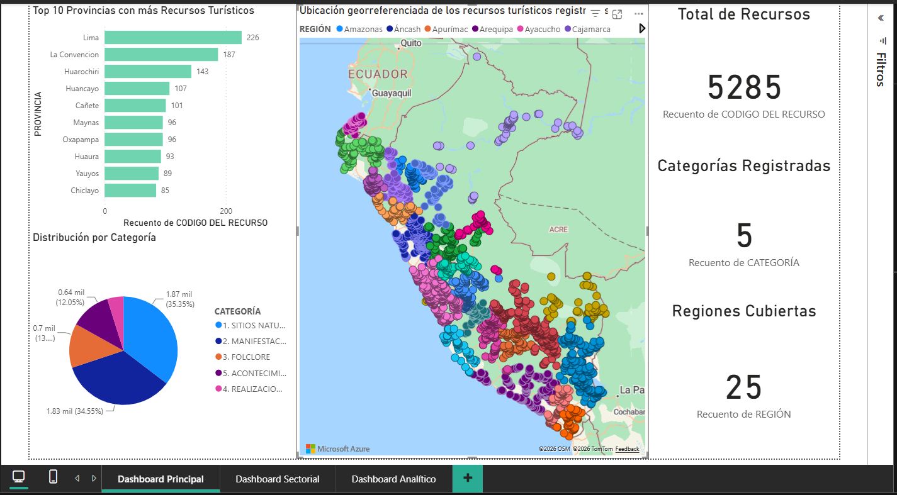
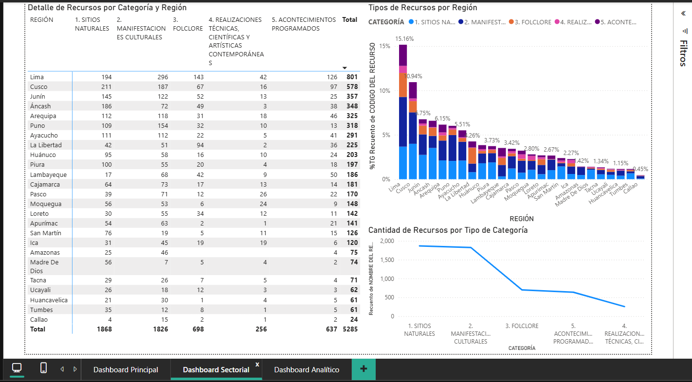
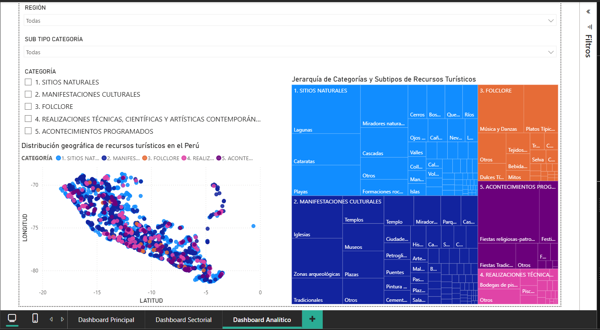

# 📊 Dashboard de Análisis de Recursos Turísticos del Perú

Dashboard interactivo desarrollado con **Microsoft Power BI** para el análisis y visualización del **Inventario de Recursos Turísticos del Perú**, utilizando datos abiertos publicados por el **Ministerio de Comercio Exterior y Turismo (MINCETUR)** a través del portal de datos abiertos del Gobierno del Perú.

El proyecto transforma un conjunto de datos georreferenciados en un sistema de visualización interactivo que permite analizar la distribución de los recursos turísticos por **región, provincia, categoría y subtipo**.

---

## 🎯 Objetivo

Analizar y visualizar la distribución de los recursos turísticos registrados en el Perú mediante herramientas de **Business Intelligence**, facilitando la identificación de concentraciones territoriales, diferencias regionales y características de los recursos registrados.

---

## 📊 Principales indicadores

| Indicador | Resultado |
|---|---:|
| 🏛️ Recursos turísticos registrados | **5,285** |
| 🗺️ Regiones cubiertas | **25** |
| 📂 Categorías principales | **5** |
| 📑 Páginas del dashboard | **3** |

---

## 📂 Categorías analizadas

1. **Sitios Naturales**
2. **Manifestaciones Culturales**
3. **Folclore**
4. **Realizaciones Técnicas, Científicas y Artísticas Contemporáneas**
5. **Acontecimientos Programados**

---

## 🗃️ Dataset

### Inventario de Recursos Turísticos del Perú

El proyecto utiliza el conjunto de datos **Inventario de Recursos Turísticos del Perú**, administrado por el **Ministerio de Comercio Exterior y Turismo (MINCETUR)** y disponible mediante el portal de datos abiertos del Gobierno del Perú.

El dataset contiene información georreferenciada y descriptiva de los recursos turísticos a nivel nacional.

### Principales variables

- Región
- Provincia
- Distrito
- Nombre del recurso
- Categoría
- Tipo de categoría
- Subtipo
- Latitud
- Longitud
- Fecha de registro

📌 **Fuente:** Ministerio de Comercio Exterior y Turismo (MINCETUR) — Portal de Datos Abiertos del Gobierno del Perú.

---

## 🔄 Metodología

El desarrollo del proyecto siguió un proceso estructurado de preparación, transformación y visualización de datos.

### 1. Obtención del dataset

Se utilizó el conjunto de datos **Inventario de Recursos Turísticos del Perú**, obtenido desde el portal de datos abiertos del Gobierno del Perú.

### 2. Limpieza y preparación

Mediante **Power Query** se realizaron procesos de:

- Eliminación de registros duplicados.
- Tratamiento de valores vacíos.
- Corrección de registros inconsistentes.
- Ajuste de tipos de datos.
- Normalización de categorías y subcategorías.
- Homogeneización de nombres de regiones.
- Preparación de coordenadas geográficas.

### 3. Transformación

Se realizaron transformaciones para garantizar la correcta utilización de los datos en las visualizaciones, incluyendo la conversión y validación de coordenadas de latitud y longitud.

### 4. Diseño del dashboard

Se desarrollaron tres páginas interactivas:

- **Dashboard Principal**
- **Dashboard Sectorial**
- **Dashboard Analítico**

### 5. Implementación de filtros

Se incorporaron segmentadores interactivos para explorar los datos según:

- Región
- Categoría
- Subcategoría

---

# 📈 Dashboards

## 01. Dashboard Principal — Vista Ejecutiva

Presenta una visión general del Inventario de Recursos Turísticos del Perú.

### Visualizaciones

- 📌 Tarjetas KPI con indicadores principales.
- 🗺️ Mapa geográfico de recursos turísticos.
- 📊 Ranking de provincias con mayor cantidad de recursos.
- 🍩 Distribución de recursos por categoría.
- 🔎 Filtros interactivos.

### 📸 Vista previa



---

## 02. Dashboard Sectorial — Análisis por Región y Categoría

Permite realizar comparaciones entre regiones y categorías de recursos turísticos.

### Visualizaciones

- 📊 Gráficos de columnas apiladas.
- 📋 Matriz de detalle por región y categoría.
- 📈 Análisis de cantidad de recursos por categoría.
- 🗺️ Comparaciones regionales.
- 🔎 Filtros interactivos.

### 📸 Vista previa



---

## 03. Dashboard Analítico — Insights Avanzados

Está orientado a una exploración más detallada de los patrones existentes dentro del dataset.

### Visualizaciones

- 🗺️ Distribución geográfica mediante coordenadas.
- 🌳 Jerarquía de categorías y subtipos.
- 📊 Treemap.
- 📍 Análisis de distribución.
- 🔎 Segmentadores interactivos.
- 📂 Exploración por región, categoría y subtipo.

### 📸 Vista previa



---

# 🔎 Principales hallazgos

### 📍 Concentración en Lima

La región **Lima registra 801 recursos turísticos**, representando aproximadamente el **15.16 % del total nacional**, posicionándose como una de las regiones con mayor concentración de recursos registrados.

### 🌎 Diferencias territoriales

Regiones como **Tumbes y Callao** presentan una menor cantidad de recursos registrados en comparación con otras regiones, permitiendo identificar diferencias en la distribución territorial del inventario turístico.

### 🌿 Predominio de recursos naturales y culturales

Las categorías **Sitios Naturales** y **Manifestaciones Culturales** concentran en conjunto más del **69.9 % de los registros**, evidenciando la importante presencia del patrimonio natural y cultural dentro del inventario turístico nacional.

### 📊 Potencial para la toma de decisiones

La combinación de indicadores, mapas, gráficos y segmentadores permite explorar patrones territoriales y categóricos que pueden servir como apoyo para el análisis y la planificación turística.

---

# 💡 Insights y recomendaciones

## Insights

- Lima presenta una importante concentración de recursos turísticos registrados.
- Existen diferencias significativas en la cantidad de recursos entre regiones.
- Los recursos naturales y culturales representan la mayor parte del inventario.
- La distribución geográfica permite identificar zonas con mayor y menor concentración de recursos.

## Recomendaciones

1. Analizar las regiones con menor cantidad de recursos registrados para identificar oportunidades de desarrollo y promoción turística.
2. Incorporar indicadores adicionales que permitan evaluar el impacto y desempeño turístico de cada región.
3. Actualizar periódicamente el inventario para facilitar comparaciones entre diferentes periodos.
4. Integrar información complementaria como afluencia turística, población, presupuesto regional y PBI regional.
5. Incorporar técnicas de inteligencia artificial y análisis predictivo para complementar el análisis descriptivo.

---

# ⚠️ Limitaciones

### Cobertura temporal

El dataset utilizado corresponde a una fecha de corte específica, por lo que el análisis representa principalmente una fotografía del inventario en ese momento y no permite realizar un análisis histórico completo.

### Ausencia de variables contextuales

El conjunto de datos se concentra en los recursos turísticos registrados y no incorpora directamente variables como:

- Población
- Presupuesto regional
- Afluencia turística
- PBI regional
- Nivel de desarrollo económico

Por ello, las diferencias observadas entre regiones no deben interpretarse por sí solas como diferencias en desarrollo turístico.

---

# 🚀 Posibles mejoras

### Incorporación de series temporales

Integrar datos de diferentes años permitiría analizar la evolución del inventario turístico y detectar tendencias.

### Integración de fuentes adicionales

Combinar el inventario con datos de:

- Visitantes nacionales e internacionales
- Población
- PBI regional
- Presupuesto público
- Infraestructura turística

permitiría realizar análisis más completos.

### Inteligencia artificial

La incorporación de herramientas de IA y análisis predictivo podría permitir identificar patrones, generar insights adicionales y desarrollar modelos orientados a la planificación turística.

---

# 🛠️ Tecnologías utilizadas

| Tecnología | Uso |
|---|---|
| **Microsoft Power BI** | Desarrollo de dashboards y visualizaciones |
| **Power Query** | Limpieza y transformación de datos |
| **DAX** | Creación de medidas y cálculos |
| **Microsoft Bing Maps** | Visualización geográfica |
| **Git / GitHub** | Control de versiones y publicación del proyecto |

---

# 📁 Estructura del repositorio

```text
dashboard-powerbi-recursos-turisticos-peru/
│
├── capturas/
│   ├── principal.png
│   ├── sectorial.png
│   └── analitico.png
│
├── Analisis de datos_tarea.pbix
├── INFORME_DE_ANALISIS.pdf
└── README.md